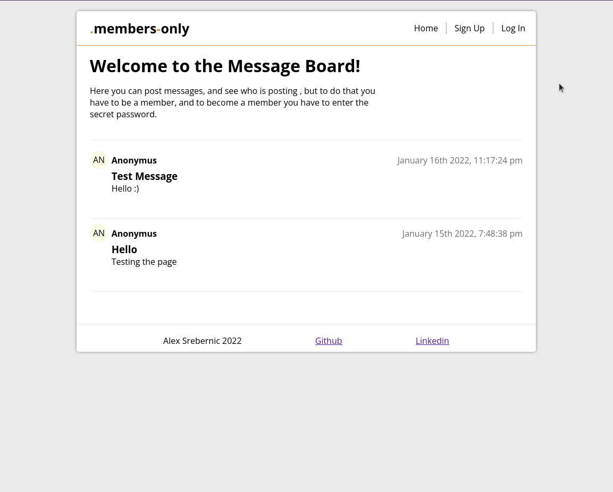

# Members_Only_TOP
## Alex Srebernic      

This is a message-board where you can post messages and become a member to see other peoples names.   
In this app i learn to use:   
- Express
- Cookies
- passport.js
- .env
- MongoDB
- Mongoose   
- Pug

[LIVE SERVER](https://glacial-reef-98320.herokuapp.com/)

# Run app locally   
The steps to run this app locally are:  
1. Clone,pull or download this repository.
2. Open folder in code editor and change process.env.MONGODB_URI variable to your mongoDB url
3. Run in terminal npm run devstart
4. Go to http://localhost:3000
